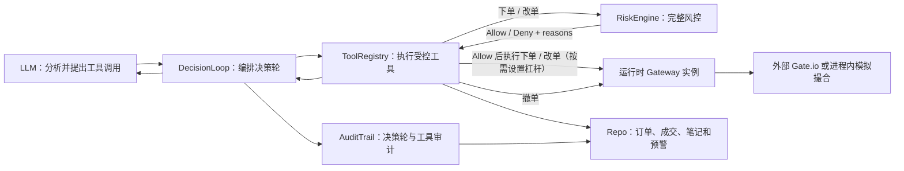
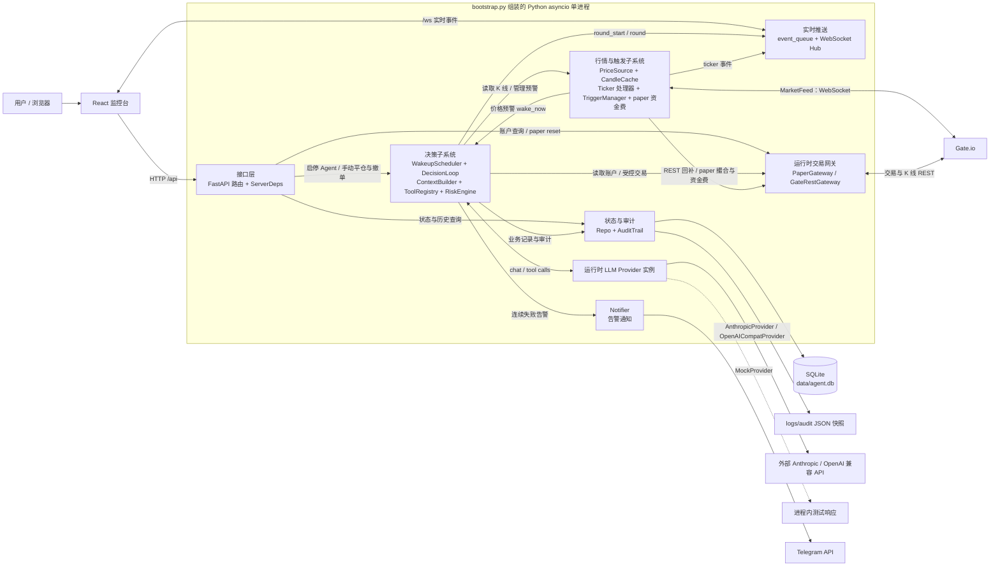
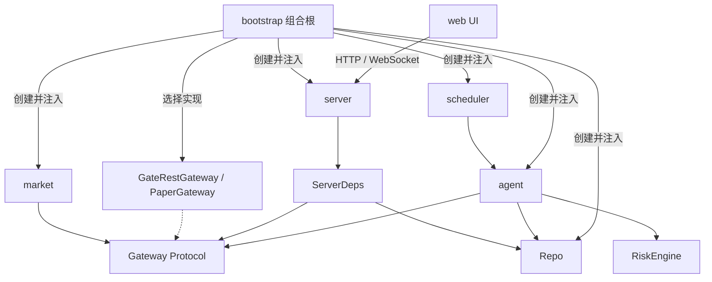
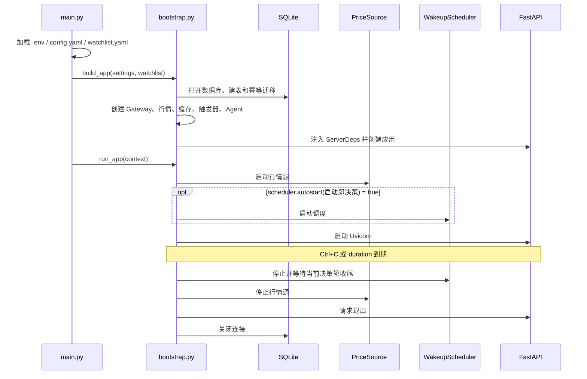
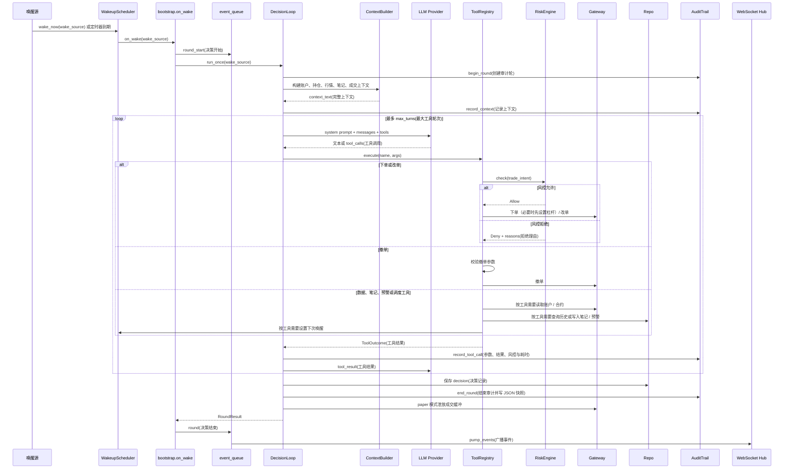
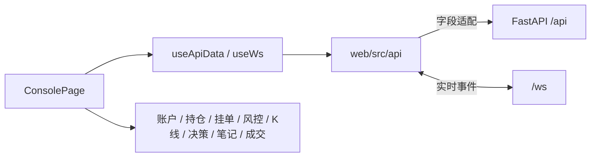
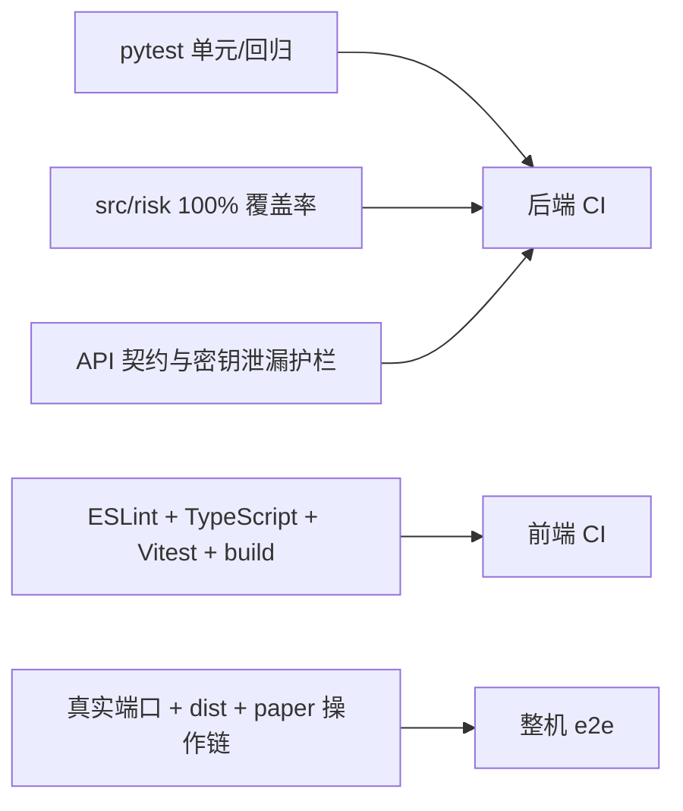

# llm-transaction 项目架构

本文描述当前代码的系统边界、模块职责和关键运行链路。实现发生变化时，应以代码与自动化测试为准，并同步更新本文。

## 1. 架构目标与核心约束

系统让 LLM 读取行情和账户上下文、调用受控工具并安排下一次唤醒，但不把最终交易权限直接交给 LLM。

系统不可违反的核心约束：

- 所有 LLM 下单和改单意图必须先经过 `RiskEngine(风控引擎)`；设置杠杆也必须通过代码中的 `risk.max_leverage(最大杠杆)` 上限，LLM 不能绕过这些代码约束。
- `GATE_API_KEY(交易所访问密钥)`、`GATE_API_SECRET(交易所签名密钥)` 只从 `.env` 读取，不进入 API 响应、日志或前端。
- 金额、价格和数量在后端业务链路使用 `Decimal(十进制定点数)`；SQLite 以 TEXT 保存其字符串，避免二进制浮点误差。
- `Gateway(交易网关接口)` 隔离业务层与 Gate SDK；paper、testnet、live 对上层暴露同一组交易语义。
- 被工具层标记为 `is_close(平仓或减仓)` 的意图会豁免多数开仓限制；限价减仓仍受委托价偏离规则约束。当前改单方向识别存在已知边界，见“风控边界”。
- LLM 决策轮、工具调用、风控结论和决策异常必须可审计；人工 API 操作至少保留对应业务记录，是否纳入统一审计是后续扩展边界。

## 2. 系统全景

后端是一个 asyncio 单进程应用。`src/bootstrap.py` 作为组合根创建依赖，并并发运行行情源、决策调度器、FastAPI、WebSocket 事件泵和 paper 资金费任务。

开发环境中，Vite 运行在 `17576` 端口，并把 `/api` 和 `/ws` 代理到 FastAPI 的 `17577` 端口。存在 `web/dist` 时，FastAPI 会在根路径直接托管前端静态文件。

## 3. 目录与模块职责

| 路径 | 职责 | 主要边界 |
| --- | --- | --- |
| `src/main.py` | 加载 `.env`、配置和日志，启动应用 | 只处理入口与顶层生命周期 |
| `src/bootstrap.py` | 创建并连接全部运行时组件 | 项目的组合根；具体依赖在此选择 |
| `src/config.py` / `src/config_io.py` | 配置模型、读取、校验与安全写回 | 运行时 YAML 与密钥环境变量分离 |
| `src/gateway/` | 交易所领域模型、Protocol、Gate REST 与 mock | 业务层不直接依赖 Gate SDK 类型 |
| `src/market/` | WebSocket 行情、K 线缓存、价格触发器 | 行情接入与交易决策解耦 |
| `src/paper/` | 模拟账户、撮合、资金费与强平 | 实现与真实网关相同的接口 |
| `src/risk/` | 无状态风控引擎与纯函数规则 | 下单/改单调用 RiskEngine；撤单不调用；设置杠杆由 Agent 工具层独立校验上限 |
| `src/agent/` | 上下文构造、LLM Provider、决策循环和工具 | LLM 只能经 ToolRegistry 影响系统 |
| `src/scheduler/` | 定时、手动和价格告警唤醒 | 保证同一时间最多执行一轮决策 |
| `src/review/` | 复盘 LLM 循环、只读工具集、策略版本管理与每日调度 | 无任何交易工具、不持有 Gateway；唯一写出口经 StrategyStore 校验 |
| `src/memory/` | SQLite 建表、模型与 Repo | 业务层不直接写 SQL |
| `src/audit/` | 决策轮与工具调用审计 | 保存输入、输出、风控结论和耗时 |
| `src/server/` | FastAPI、WebSocket、静态文件与依赖容器 | 通过 `ServerDeps(服务依赖容器)` 调用运行时能力 |
| `src/notify/` | Telegram 等通知出口 | 通过接口与 Agent 解耦 |
| `web/src/api/` | HTTP/WS 客户端、契约类型与字段适配 | 页面不直接处理后端原始字段 |
| `web/src/pages/` / `web/src/components/` | 单页监控台与业务组件 | 展示状态并触发受控 API 操作 |
| `tests/` | 后端单元、集成、契约与回归测试 | `src/risk/` 覆盖率必须为 100% |
| `scripts/` | 联调、整机冒烟、Git 钩子辅助与部署脚本 | 手动验证脚本不进入常规 pytest 套件 |

依赖方向以“领域接口优先”为原则：

图中实线表示源码依赖或运行时调用，标有“创建并注入”的箭头表示组合根的组装行为，虚线表示接口实现关系。`server` 不应直接导入 Agent、调度器或行情源的具体实现；写操作通过 `ServerDeps` 注入的回调进入业务层。`bootstrap` 可以依赖具体实现，因为它负责最终组装。

## 4. 启动与关闭链路

`scheduler.autostart(启动后自动决策)` 默认是 `false`。此时行情与监控服务会正常启动，用户在前端点击“启动 agent”后，调度器立即以 `manual_start(手动启动)` 原因唤醒第一轮。

## 5. 单轮决策链路

一轮决策可由定时器、用户启动 Agent 或价格预警触发。决策轮内到达的外部抢醒只保留最后一个原因，并在轮末补一次；定时器到期事件则丢弃，避免同时运行多个 LLM 决策轮。

当前 LLM 工具分为三类：

- 读取：`get_market_data(读取行情)`、`get_history(读取历史)`。
- 交易：`place_order(下单)`、`update_tpsl(更新止盈止损)`、`amend_order(改单)`、`cancel_order(撤单)`。
- 自主管理：`set_price_alert(设置价格预警)`、`set_next_wakeup(安排下次唤醒)`、`write_note(跨轮笔记)`。

工具异常会被转换为可读结果返回给 LLM，使其有机会在本轮修正参数；工具内部异常仍写日志，但不会直接击穿整轮循环。

复盘 agent 使用独立的工具组，与上述决策工具零交集：7 个只读工具（`get_review_stats`、`list_decision_rounds`、`get_decision_detail`、`get_tool_call_chain`、`list_trades`、`get_round_context`、`get_strategy_versions`）只经 `Repo` 与审计表查询历史；`submit_strategy_revision(提交策略修订)` 是唯一写出口，提交的策略书新文本经 `StrategyStore` 校验后才生效。

### 复盘链路

复盘链路与交易决策链路同进程但解耦，不复用上述唤醒调度。每日到点（`review.daily_time`，巡检循环每分钟检查）或经 `POST /api/review/run` 手动触发后，`ReviewAgent` 以 `wake_source='review'` 开启一条审计轮：先向 LLM 发送中文简报（复盘区间、当前策略书全文、代码侧预统计），随后进行最多 12 轮只读工具调用，工具循环结束后的最终文本落库为复盘报告。若 LLM 调用 `submit_strategy_revision`，`StrategyStore` 校验（strip 后 ≥100 字符、UTF-8 ≤32KB、与当前版本有差异）通过后经临时文件原子替换 `system_prompt.md` 并落新版本，下一轮决策由 `PromptLoader` mtime 热重载自动生效。复盘任何失败只落 error 报告、审计轮 error 并告警，绝不向上抛，交易决策循环零感知。

## 6. 风控边界

`RiskEngine` 对同一输入产生确定性结果，并汇总全部拒绝理由。当前规则如下：

| 配置或规则 | 具体含义 | 开仓 | 平仓/减仓 |
| --- | --- | --- | --- |
| `watchlist.contracts(交易白名单)` | 允许新开仓的合约集合 | 必须命中 | 豁免 |
| `risk.kill_switch(开仓总闸)` | 紧急禁止新增风险 | 开启时拒绝 | 豁免 |
| `risk.max_position_pct(单笔交易意图名义价值上限)` | 单笔意图名义价值相对账户权益上限；配置键名称沿用 `max_position_pct` | 校验 | 豁免 |
| `risk.max_total_position_pct(总持仓权益占比上限)` | 当前持仓加本单后的总名义价值上限 | 校验 | 豁免 |
| `risk.max_leverage(最大杠杆)` | 请求杠杆倍数上限 | 校验 | 豁免 |
| `risk.daily_loss_limit(日亏损比例上限)` | 已实现与未实现亏损合计触线后只平不开 | 校验 | 豁免 |
| `risk.max_orders_per_day(日开仓单数上限)` | 当日可新增的开仓订单数量 | 校验 | 豁免 |
| `risk.max_deviation(委托价偏离上限)` | 限价相对标记价的最大偏离 | 校验 | 限价减仓仍校验；`close=true(全部平仓)` 按市价执行 |

当前实现有两个需要在后续风控改动中处理的边界：

- `risk.max_position_pct` 当前只检查本次意图的名义价值，不聚合同一合约的已有仓位；同一合约多次加仓主要由 `risk.max_total_position_pct(总持仓权益占比上限)` 兜底。若产品要求“单合约最终净仓上限”，应另行修改规则、前端标签并补回归测试。
- `amend_order(改单)` 当前仅根据新订单方向是否与持仓相反来推断 `is_close`，没有校验反向数量是否超过现有仓位。在 paper 模式中，超量反向改单成交后可能先平仓再翻向开仓，却仍使用平仓豁免。修复时应先补超量反向改单回归测试，再收紧方向与数量判定。

若 LLM 连续失败次数达到 `llm.max_consecutive_failures(最大连续失败次数)`，决策循环会开启风险锁并通过通知出口告警。LLM 未配置时会跳过决策，但 paper 成交缓冲仍会被处理，避免非 LLM 成交丢失。

## 7. 运行模式与外部依赖

| `mode(运行模式)` | 行情来源 | 交易执行 | 典型用途 |
| --- | --- | --- | --- |
| `paper(模拟模式)` | Gate 公共行情；测试可注入手动行情 | `PaperGateway(模拟撮合网关)` | 默认开发、回归与策略观察 |
| `testnet(测试网模式)` | Gate 测试网行情 | `GateRestGateway(真实 REST 网关)` 指向测试网 | 带密钥的交易闭环联调 |
| `live(实盘模式)` | Gate 正式行情 | `GateRestGateway(真实 REST 网关)` 指向正式环境 | 用户显式开启后的真实交易 |

paper 模式会处理滑点、挂单成交、资金费和强平等模拟账户行为。testnet/live 共用 `GateRestGateway`，根据 mode 选择不同主机；两者读取相同名称的 `GATE_API_KEY(交易所访问密钥)`、`GATE_API_SECRET(交易所签名密钥)`，变量值必须与目标环境匹配。

LLM Provider 通过统一接口接入：

- `AnthropicProvider(Anthropic 模型适配器)`。
- `OpenAICompatProvider(OpenAI 兼容接口适配器)`。
- `MockProvider(测试适配器)`。

LLM key 或模型配置更新后可以热重建 Provider；`mode(运行模式)`、Gate 主机和服务监听地址等构造期配置需要重启。

## 8. HTTP、WebSocket 与前端

FastAPI 路由按职责拆分：

- `routes_status.py`：运行状态、账户、持仓、决策轮、成交、权益和笔记。
- `routes_config.py`：配置、策略、白名单、LLM 密钥状态和 `kill_switch(开仓总闸)`。
- `routes_review.py`：复盘报告分页列表与详情（`GET /api/review/reports`、`GET /api/review/reports/{id}`）、手动触发昨日区间复盘（`POST /api/review/run`，回调未接线或 LLM 未配置 503、复盘进行中 409）、策略版本列表与详情（`GET /api/strategy/versions`、`GET /api/strategy/versions/{id}`）、两版本 unified diff（`GET /api/strategy/diff?from=&to=`，纯文本）与回滚（`POST /api/strategy/rollback/{id}`，未接线 503、版本不存在 404）。
- `routes_trading.py`：未成交挂单、手动撤单、手动平仓、paper 重置、Agent 启停和 K 线。
- `ws.py`：广播 `ticker(实时价格)`、`round_start(决策开始)` 和 `round(决策结束)` 等事件。

`PUT /api/strategy` 行为变化：接线后改走 `StrategyStore`（与复盘改写同一路径），保存即记策略版本；strip 后不足 100 字符或 UTF-8 体积超 32KB 返回 422（detail 为全部未过原因），仅“与当前版本无差异”视为幂等成功（不产新版本）；响应契约保持 `PlainText` 原文不变。

前端是单页控制台：

`web/src/api/http.ts` 是后端原始响应到前端模型的集中适配层，例如把 `created_at(Unix 秒时间)` 转为 ISO 时间，把 Decimal 字符串转为展示用 number。页面组件不应重复这些转换。

当前监控 API 默认无鉴权且使用 HTTP，默认仅监听 `127.0.0.1`。在加入鉴权、TLS 和访问控制前，不应直接绑定公网或不可信局域网地址。

## 9. 持久化与审计模型

默认数据库为 `data/agent.db`，使用 SQLite WAL 模式。每轮结束时，`AuditTrail(审计追踪器)` 还会把完整记录写入 `logs/audit/round_<round_id>.json`，形成 SQLite 与 JSON 快照双写。

| 表 | 具体含义 | 关键字段 |
| --- | --- | --- |
| `decisions(决策记录)` | 每轮最终决策摘要与 LLM 原始输出 | `round_id(决策轮标识)`、`wake_source(唤醒来源)`、`strategy_md5(策略书原文摘要)` |
| `orders(订单记录)` | 本地下单记录，以及已显式同步的改单/撤单状态 | `side_size(带方向张数)`、`is_close(是否平仓)` |
| `trades(成交记录)` | 成交、手续费和已实现盈亏 | `source(成交来源)`、`pnl(已实现盈亏)` |
| `notes(Agent 笔记)` | 跨决策轮传递的判断要点 | `content(笔记正文)` |
| `alerts(价格预警)` | 越线后触发调度器唤醒 | `direction(越线方向)`、`active(是否有效)` |
| `wakeup(预留唤醒记录)` | 已建表并提供 Repo 写入方法，但当前调度器和工具均未接线 | `scheduled_at(计划时间)`、`source(来源)` |
| `audit_rounds(决策轮审计)` | prompt、上下文、原始输出、异常和耗时边界 | `prompt_md5(策略版本摘要)`、`strategy_md5(策略书原文摘要)`、`error(异常)` |
| `audit_tool_calls(工具审计)` | 每次工具调用的参数、风控、结果和耗时 | `risk_verdict(风控结论)`、`duration_ms(耗时毫秒)` |
| `strategy_versions(策略书版本)` | 策略书全文版本化留痕（人工保存、复盘改写与回滚同走此表） | `created_by(版本来源)`、`md5(策略书原文摘要)`、`report_id(关联复盘报告)` |
| `review_reports(复盘报告)` | 每次复盘的区间统计、报告全文与策略动作 | `period_start/period_end(复盘区间)`、`strategy_action(策略动作)`、`new_version_id(产生的新版本)` |

注意 `decisions.strategy_version(策略版本摘要)` 与 `strategy_md5(策略书原文摘要)` 语义不同：前者是“策略书+工具说明段”拼装后的 md5（与 `audit_rounds.prompt_md5` 同值），后者是策略书原文的 md5（与 `strategy_versions.md5` 关联，供按策略版本统计）。历史数据的 `strategy_md5` 保持空串不回填；`round_id` 无法 join 到 `decisions` 的成交不参与按策略统计。

`Repo(存取仓库)` 是业务层唯一的数据库访问入口。金额和数量以 Decimal 字符串写入 TEXT 列，读取时由领域模型还原。

## 10. 配置与状态来源

| 文件或对象 | 具体含义 | 是否纳入版本控制 |
| --- | --- | --- |
| `.env` | 交易所与 LLM 密钥 | 否 |
| `config.yaml` | 运行模式、风控、调度、模型、服务等运行参数 | 否，仅跟踪模板 |
| `watchlist.yaml` | 可交易合约白名单 | 否，仅跟踪模板 |
| `system_prompt.md` | 每轮加载的策略提示词 | 否，仅跟踪模板 |
| `review_prompt.md` | 复盘 agent 的 system prompt（模板为 `review_prompt.example.md`） | 否，仅跟踪模板 |
| `Settings(运行时配置对象)` | 已校验并注入各组件的内存配置 | 进程内 |
| `ServerDeps(服务依赖容器)` | FastAPI 可调用的运行时能力与路径 | 进程内 |

前端保存配置时，服务端先合并未提交字段、执行 Pydantic 校验并安全写回。风控、调度、paper 滑点、复盘和部分 LLM 配置会同步到共享运行时对象；构造期字段会在响应中标记需要重启。`review.enabled(复盘开关)` 默认 true、`review.daily_time(每日触发时间，本地 HH:MM)` 默认 03:00，两者支持热写回——复盘巡检循环每次 tick 读取运行时配置，改开关或触发时间即时生效。

## 11. 测试与质量门禁

- 后端测试覆盖配置、网关、行情、风控、Agent、持久化、API、通知和生命周期。
- `tests/test_contract.py` 冻结前端消费的端点字段和类型，并递归检查响应中不存在密钥。
- `src/risk/` 必须达到 100% 覆盖率。
- 前端使用 Vitest 验证 API 适配、页面状态和关键交互。
- `scripts/e2e_web_smoke.py` 验证生产前端静态托管与 paper 操作链。

## 12. 修改架构时的同步清单

修改下列边界时，应同步维护对应事实来源：

- 新增 LLM 工具：同时更新 `tool_schemas.py(工具描述)`、`tools.py(工具注册)`、处理函数、审计测试和本文工具清单。
- 新增复盘工具：同时更新 `src/review/tool_schemas.py(复盘工具描述)`、`src/review/tools.py(复盘工具注册)`、处理函数、审计测试和本文复盘工具清单。
- 新增交易能力：先定义风控不变量，再补 `src/risk/` 规则或明确豁免，并维持 100% 覆盖率。
- 修改 Gateway：保持 Protocol、Gate 实现、paper/mock 实现和契约测试一致。
- 修改 API：同步 `web/src/api/types.ts(前端契约类型)`、`http.ts(响应适配)` 与 `tests/test_contract.py`。
- 修改数据库：在 `db.py` 增加幂等迁移，通过 `Repo` 暴露能力，禁止业务模块直接写 SQL。
- 修改实时事件：同步后端事件生产、`ws.py` 广播和前端 `WsMessage(实时消息类型)` 消费逻辑。
- 修改启动依赖：只在 `bootstrap.py` 选择和连接具体实现，保持业务模块依赖接口。
