# 部署指南

部署属于运维流程，与项目介绍和本地快速开始分开维护。当前方案面向使用 systemd user service 的 Linux 服务器，通过 GitHub Actions 手动触发。

## 自动化流程

在 GitHub 仓库中打开 Actions → CD → Run workflow，输入 `deploy` 确认。工作流始终从 `main` 构建，并以同一提交检出 `deploy.sh`、构建前端，再把完整 SHA 传给服务器；成功时前后端来自同一提交，失败时自动尝试恢复上一提交的代码、依赖和前端产物。

```mermaid
flowchart LR
    Trigger["手动触发 GitHub Actions"] --> Build["云端构建 web/dist"]
    Build --> Pin["记录 commit_sha<br/>部署提交标识"]
    Pin --> Upload["SSH 上传前端产物"]
    Upload --> Script["通过 SSH stdin 执行同提交 deploy.sh"]
    Script --> Checkout["fetch main 并切到 commit_sha"]
    Checkout --> Sync["uv sync 同步后端依赖"]
    Sync --> Unpack["临时目录解包并校验 web/dist"]
    Unpack --> Stop["停止 Agent 调度并等待当前决策轮结束"]
    Stop --> Switch["备份旧 dist 并切换新 dist"]
    Switch --> Start["启动新版本"]
    Start --> Health["GET /api/status 健康检查"]
    Health -->|"失败"| Rollback["恢复上一提交、依赖和 dist 并重启"]
```



工作流定义见 `.github/workflows/cd.yml`，服务器端执行逻辑见 `scripts/deploy.sh`。

工作流把与前端产物同一提交的 `scripts/deploy.sh` 通过 SSH 标准输入发送到服务器，首次升级也不会误用服务器旧脚本。脚本在切换前保留上一版 `web/dist(前端构建产物)`；从切换提交开始，依赖同步、解包、重启或健康检查任一步失败，都会尝试恢复上一提交、Python 依赖和前端产物，并在服务已被触及时重启服务。

## 一次性服务器准备

以下命令以 Ubuntu/Debian 为例：

```bash
# 依赖：git + uv。前端 dist 由 GitHub Actions 构建，服务器无需 Node.js。
curl -LsSf https://astral.sh/uv/install.sh | sh
git clone https://github.com/djfch/llm_transaction.git /opt/llm_transaction
cd /opt/llm_transaction

# 密钥与运行时配置不入库，首次部署时从模板创建。
cp .env.example .env
$EDITOR .env
cp config.example.yaml config.yaml
cp watchlist.example.yaml watchlist.yaml
cp system_prompt.example.md system_prompt.md
uv sync

# systemd user service；先按文件头注释替换路径占位符。
mkdir -p ~/.config/systemd/user
cp deploy/llm-transaction.service ~/.config/systemd/user/
$EDITOR ~/.config/systemd/user/llm-transaction.service
systemctl --user daemon-reload
systemctl --user enable --now llm-transaction

# 注销后保持用户服务运行。
sudo loginctl enable-linger "$USER"

# 首次健康检查。
curl http://127.0.0.1:17577/api/status
```

## GitHub 仓库配置

在仓库 Settings → Secrets and variables → Actions 中配置：

| 类型 | 名称 | 具体含义 |
| --- | --- | --- |
| Secret | `SSH_PRIVATE_KEY(部署私钥)` | 对应公钥必须已加入服务器用户的 `~/.ssh/authorized_keys` |
| Secret | `SERVER_HOST(服务器地址)` | SSH 目标主机名或 IP |
| Secret | `SERVER_USER(服务器用户)` | 执行部署和 systemd user service 的用户 |
| Variable | `DEPLOY_PATH(服务器仓库路径)` | 例如 `/opt/llm_transaction` |
| Variable | `SERVER_PORT(SSH 端口)` | 可选，默认 `22` |

交易所和 LLM 密钥保存在服务器 `.env`，不通过部署工作流上传，也不得写入仓库、API 响应或日志。

## 部署前检查

- `main` 分支 CI 已全部通过，并由人确认可以部署；工作流会忽略界面选择的其他 ref，始终构建 `main`。
- 服务器工作目录的 `config.yaml`、`watchlist.yaml`、`system_prompt.md` 和 `.env` 已正确配置。
- `llm-transaction.service` 中的工作目录、启动命令和环境符合服务器实际路径。
- 监控 API 默认无鉴权；在加入鉴权与 TLS 前，只监听回环地址或放在受控反向代理后。
